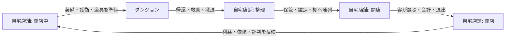
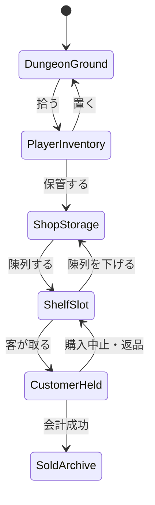

# Dungeon Curio Merchant — ゲーム方針・実装計画

更新日: 2026-08-16  
状態: 優先度Aを確定。Phase 0.5〜4を実装済み（1サイクルが繋がった状態）

## 1. この文書の目的

本作を、町を歩いて施設を巡るRPGから、次の2本の遊びを往復するゲームへ再構成する。

1. 護衛とダンジョンを探索し、珍品・遺品・素材を持ち帰る。
2. 自宅兼店舗に品物を並べ、来店客へ販売して次の探索を準備する。

この文書は、現在のブラウザ版MVPとUnity移植状況を踏まえた、ゲーム設計・データ設計・実装順序・未決事項の基準である。ここではコードを実装せず、仕様を確定するための論点を管理する。

## 2. 現時点で確定する方針

| 項目 | 方針 |
| --- | --- |
| 開発基盤 | Unityを最終実装とし、ブラウザ版のドメインロジックを参考実装として段階的に移植する |
| 拠点 | 町を廃止し、自宅兼店舗を唯一のホームにする |
| 基本ループ | 自宅店舗で準備 → ダンジョン探索 → 帰還 → 整理・陳列 → 開店・販売 → 次の準備 |
| ダンジョン戦闘 | 戦闘画面へ切り替えず、ダンジョンのマス上で解決する |
| ダンジョン時間 | 主人公が1手行動すると、護衛と敵も1手行動するターン制を第一候補とする |
| 主人公 | 商人であり、戦闘能力は低い。移動、探索、回避、道具、品物の回収が主な役割 |
| 護衛 | 自動行動で主人公を守る。迎撃、攻撃、押し出し、追従を担当する |
| 操作 | 通常行動はフィールド上の専用キーで直接実行し、共通アクションメニューを毎回開かない |
| 所持品 | 道具袋、5枠のクイックスロット、選択中の手持ちを分けて管理する |
| 店舗 | 棚・カウンター・入口・保管場所を持つ、実際に歩ける2D店舗にする |
| 販売 | 棚へ置かれた現物を客が選び、手に取り、レジへ並び、会計して退出する |
| 外部サービス | 護衛契約、仕入れ、鑑定、依頼などは店舗からアクセスできるようにする |

「1手ごとのダンジョン」は、ARPGのように同じ画面上で敵と護衛が動くが、リアルタイムではなく判断可能なフィールド戦として扱う。リアルタイム化は、この方式の縦切り試作を評価した後に再検討する。

## 3. 現在の実装と目標との差分

### 3.1 ブラウザ版MVPに存在するもの

- 町、室内、ダンジョンのロケーション区分
- 1マス移動ごとのダンジョンターン進行
- 主人公 → 護衛 → 敵の行動順
- 敵の巡回、追跡、探索状態
- 護衛の追従、隣接攻撃、HP、負傷、レベル、契約料
- 主人公によるダメージなしの押し返し、煙玉、帰還石
- 地面の品、宝箱、罠、遺体、遺品回収
- 容量制の所持品、保管品、展示品、売却済み記録
- 顧客ごとの興味、予算、関係値、鑑定、価格差、反提案
- 依頼、日付、イベント、セーブデータ

### 3.2 ブラウザ版で作り直す必要があるもの

- 町の移動と各施設への訪問
- ギルド、顧客、鑑定先を町の座標に結び付けたUI
- メニュー操作だけで行う保管・展示・売却
- ダンジョン帰還先を「町」とする状態遷移
- 敵の討伐と戦利品の関係。現在の通常拾得物は敵討伐とは独立して配置される
- 通常の遺体には原則として遺品がなく、一部の依頼用遺体だけが遺品を持つ設計

### 3.3 Unity版の現在地

- 自由移動する町の試作シーン
- ソードマンLv.1を主人公として生成
- キャラクター画像、Animator、方向別アニメーションのインポート
- Tilemapと確認用の当たり判定レイヤー
- `Merchan.Domain`にアイテム所在モデル、道具袋、クイックスロット、セーブ、乱数を実装済み
- ダンジョン、護衛AI、敵AI、ターン解決、店舗、顧客、販売は未移植

したがって、Unityの現在の町用`MerchanBootstrap`を拡張し続けるのではなく、ゲームルールを純粋なC#ドメイン層へ移し、店舗とダンジョンを別のプレゼンテーションとして接続する。

## 4. 目標とするゲームループ



1サイクルは必ずしも1日と一致させない。日付を進めるタイミングは未決事項だが、初期案では「ダンジョンから帰還した時」ではなく「店を閉めた時」を1日の終了とする。探索せず店だけ開ける日、店を開けず連続探索する日を許すかは別途決める。

## 5. ゲームモード

### 5.1 店舗・閉店中

自由移動で次を行う。

- ダンジョンから持ち帰った品を保管する
- 品を調べる、鑑定へ出す、帳簿を見る
- 保管場所から品を持ち出し、棚の空きスロットへ置く
- 売れた棚を補充する
- 護衛契約、仕入れ、依頼、外部の専門家へアクセスする
- 出口からダンジョンへ向かう
- カウンターで開店を開始する

### 5.2 店舗・開店中

客と店員がリアルタイムに動く店舗運営モードとする。メニュー表示中は一時停止できるようにする。

- 客が入口から入る
- 客が要望、興味、予算に従って棚を評価する
- 客が商品を予約して棚から取る
- 客がレジ待ち列へ移動する
- 主人公がカウンターに立つと会計を処理する
- 売却、値段交渉、鑑定相談、依頼会話などを解決する
- 客が退出した後、主人公が棚を補充できる
- 閉店操作後、新規客の入場を止め、店内の客が退出したら営業終了する

開店中に主人公がカウンターを離れられるか、客を待たせる時間にペナルティを設けるかは未決事項である。

### 5.3 ダンジョン

グリッド上のターン制フィールドとして扱う。通常の1ターンは次の順序とする。

1. 主人公のコマンドを検証・実行する
2. 罠、拾得、地形など主人公位置の効果を解決する
3. 護衛が自動行動する
4. 敵が自動行動する
5. 撃破、ドロップ、遺体、状態異常、目的達成を確定する
6. イベントをアニメーション表示する

主人公の候補コマンドは、移動、待機、押し返し、手持ち道具の使用、弱い攻撃、調べる、拾う、遺体を探る、階段、帰還、護衛への簡単な指示とする。頻繁に使う行動は専用キーで直接実行する。

### 5.4 シームレスな直接操作

現在のように`Space`で共通メニューを開いてから行動を選ぶ方式は廃止する。主人公の向いている方向または隣接マスを対象とし、画面上には「対象名＋実行できる操作＋キー」を短く表示する。

初期キーボード割り当ては次の通り。すべてUnity Input Systemで再割り当て可能にする。

| 入力 | 基本アクション | ダンジョンでの例 | 店舗での例 |
| --- | --- | --- | --- |
| `WASD`／方向キー | 移動・向き変更 | 1マス移動 | 店内を自由移動 |
| `E` | 文脈操作 | 拾う、調べる、遺体を探る、扉・宝箱・階段 | 棚へ置く／棚から取る、会話、保管庫、カウンター、出口 |
| `R` | 押し出し | 正面の敵を1マス押す | 原則使用しない |
| `F` | 選択中の手持ちを使う | 武器で攻撃、道具を使う | 商品・道具の主動作、設備へ使用 |
| `C` | クイック消耗品 | 煙玉、回復品、帰還石 | 必要なら営業用消耗品を使用 |
| `1`〜`5`／マウスホイール | クイックスロット選択 | 手持ち武器・道具を切り替える | 棚へ置く商品・道具を選ぶ |
| `Enter` | 道具袋を開閉 | 所持品確認、クイックスロット設定 | 商品整理、保管庫との一括移動 |
| `Space` | 待機 | 1ターン待つ | 割り当てなし。将来の接客補助候補 |
| `Esc` | キャンセル／ポーズ | UIを閉じる、ポーズ | UIを閉じる、ポーズ |

`E`は対象に応じて動作が変わるが、候補を並べる共通メニューにはしない。例えば正面に未探索の遺体があれば「遺体を探る」、床アイテムがあれば「拾う」、扉があれば「開ける」となる。同じマスに複数候補がある場合だけ、小さな対象選択UIを表示する。

ダンジョンでは、次の入力だけが1ターンを消費する。

- 成功した移動
- `R`による押し出し
- `F`による攻撃または道具使用
- `C`による消耗品使用
- `E`による拾得、探索、扉、宝箱、階段などの有効な操作
- `Space`による待機

向き変更、クイックスロット選択、道具袋を開くこと、実行不能な操作はターンを消費しない。道具袋を開いている間はダンジョンを一時停止する。

### 5.5 道具袋・クイックスロット・手持ち

所持品は次の3層に分ける。

1. **道具袋**: 持ち帰った品、商品、武器、道具、消耗品を保存する本体インベントリ。
2. **クイックスロット**: 道具袋内のアイテムを5枠まで登録するショートカット。アイテムを複製せず、同じ`ItemInstance`を参照する。
3. **手持ち**: 現在選択しているクイックスロット1枠。主人公Spriteの手元表示と`F`の動作を決める。

最低限の初期ルールは次の通り。

- 道具袋はスロット数と総容量を持つ。大型品は複数容量を使う
- 素材や一般消耗品は同一定義・同品質ならスタック可能にする
- 来歴、品質、鑑定状態が異なる商品と装備は一点物としてスタックしない
- クイックスロット登録品も道具袋の容量を使用し続ける
- 売却、陳列、投棄、消費で元アイテムがなくなった場合、対応するクイックスロットを自動で空にする
- 消耗品は`C`用の優先枠を1つ指定できる。使い切った場合は同種スタックへ自動接続する
- 武器、採取道具、照明などは手持ちに選択して`F`で使う
- 商品を手持ちに選び、空の棚に向いて`E`を押すと直接陳列できる

武器を手持ちにした場合だけ主人公も`F`で正面へ攻撃できる。ただし威力、命中または耐久効率を護衛より低くし、戦闘の主役にはしない。素手攻撃は行わない。これにより「商人は戦いに不向き」という役割を保ちつつ、緊急時にプレイヤー自身が選べる行動を残す。

## 6. ダンジョンにおける役割と接触ルール

### 6.1 主人公

- 素手では攻撃せず、武器を手持ちにした場合だけ弱い正面攻撃を行える
- 敵を倒すより、避ける、押す、煙で追跡を切る、護衛へ任せることを基本にする
- HPは「商人が危険にさらされた量」を表す
- HPが0になると死亡ではなく救助され、品物・金・時間を失って店舗へ戻る

### 6.2 護衛

初期版は同行1人に限定する。護衛AIの優先順位は次の通り。

1. 主人公へ今にも接触する敵を迎撃する
2. 隣接する敵へ攻撃、または押し出しを行う
3. 主人公と敵の間に入れる位置へ移動する
4. 主人公の隣接マスへ追従する
5. 護衛固有能力を使う

主人公と護衛は同じマスを占有しない。UI上ではパーティとしてまとめて表示してよいが、フィールド上のSpriteは別のセルに置く。

### 6.3 敵との接触

- 敵は主人公または護衛のいるセルへ侵入せず、隣接時に攻撃する
- 主人公へ向かう敵に対して、護衛が条件を満たせば割り込み行動を行う
- 強い護衛は、攻撃の代わりに敵を1マス押し出せる
- 押し出し先が壁、別のActor、危険地形なら失敗または追加効果とする
- 押し出し判定は、護衛の`pushPower`と敵の`pushResistance`で解決する

初期式の候補は次の通り。

```text
pushPower + 状況補正 >= pushResistance
```

乱数を入れるかは未決事項。最初の縦切りでは結果を理解しやすい決定論を推奨する。

### 6.4 敵を倒す意味

討伐は目的ではなく、探索を安全にして品物を得る手段の一つとする。

- 避ける、追跡を切る、閉じ込める、押し返すだけでも先へ進める
- 護衛が敵を倒すと、その場に探索可能な残骸・遺体を生成する
- 遺体は未探索／探索済みの状態を持つ
- 「遺体を探る」は1ターン消費する
- 遺体の中身は素材、装備、珍品、手掛かり、何もなしのいずれか
- 大型品は所持容量を圧迫し、持ち帰る品の選択を発生させる
- 人型の遺体、魔物の残骸、機械・植物など、表現上の分類を分ける

通常敵が直接アイテムを床へ落とす方式と、遺体を探る方式を併用すると情報が重複するため、初期版は「敵撃破 → 遺体コンテナ生成 → 探って回収」に統一することを推奨する。壊れた壺や宝箱など、死体ではないオブジェクトだけ直接ドロップを使用する。

## 7. 店舗システム

### 7.1 店舗レイアウトに必要なもの

- 主人公の生活・出現位置
- ダンジョンへ向かう出口
- 客用入口
- カウンターと主人公の接客位置
- 客の会計位置と待機列スロット
- 1つ以上の棚
- 各棚の陳列スロット
- 保管庫または商品箱
- 外部サービスへアクセスする帳簿、掲示板、端末など

客と主人公の入口は同一でもよいが、開店中の動線が衝突する場合は分離する。

### 7.2 商品の状態遷移

各`ItemInstance`は同時に1か所だけに存在する。



最低限、アイテムには次の実行時情報が必要になる。

- 現在の所有者と場所
- 店舗内なら棚IDとスロットID
- 客が手に取っている場合は顧客ID
- 予約状態。複数の客が同じ商品を取らないために使用する
- 売値または価格ルール
- 鑑定状態、来歴、品質、固有性

### 7.3 棚へ商品を出すアクション

初期版は、通常の1品操作をフィールド上で直接行い、一括整理だけ道具袋UIを使用する。

1. 主人公が道具袋または保管庫から、商品をクイックスロットへ登録する
2. 対象商品を手持ちに選び、空の棚スロットへ向く
3. `E`を押して商品を直接置く
4. 対象の棚スロットに商品のSpriteを表示する
5. `ItemInstance`の場所を道具袋または保管庫から棚スロットへ変更する

棚上の商品へ向いて`E`を押すと、空き容量がある場合は道具袋へ戻す。保管庫で`E`を押した場合は道具袋と保管庫の2ペインUIを開き、複数品を整理できる。

ドラッグ＆ドロップや自由配置は後回しにする。棚スロット制にすると、客の経路探索、当たり判定、セーブ、商品予約を安定させられる。

### 7.4 顧客AI

顧客の基本状態は次の通り。

```text
Enter → Browse → ReserveItem → WalkToItem → TakeItem
      → Queue → Checkout → Leave
      → GiveUp → Leave
```

顧客は要望を持つ。要望はカテゴリ、具体的な品、予算、鑑定度、希少性、依頼目的などで表現する。

候補商品の評価には、興味、予算、主人公との関係、品の知識、品質、価格、待ち時間を使う。初期版では店内に入った時点で購入候補を決め、棚の商品を予約する。これにより複数客による同一商品の競合を防ぐ。

### 7.5 会計

- 客がレジ待ち位置へ到着したら、会計可能状態にする
- 主人公がカウンターにいる時だけ会計を開始できる
- 通常売却は提示額を確認して決定する
- 重要品や鑑定不足の品は、相談、反提案、売却拒否、特別イベントへ分岐できる
- 会計成功時に棚スロットを空け、品を売却記録へ移し、金・関係値・評判を更新する
- 会計失敗やキャンセル時は商品を棚へ戻す。元の棚が埋まっている場合は返品箱へ移す

## 8. 店舗から利用する外部サービス

町を廃止しても、機能そのものは残す。すべてを同じUIに詰めず、店舗内のオブジェクトへ割り当てる。

| 店内オブジェクト候補 | アクセスする機能 |
| --- | --- |
| 契約台帳 | 護衛の雇用、変更、負傷状況、契約料 |
| 依頼掲示板 | 依頼受注、報告、噂、探索目標 |
| 仕入れ帳・通信手段 | 他店から消耗品、棚、店設備を購入 |
| 鑑定依頼箱 | 専門家へ鑑定を依頼。即時または日数経過で返却 |
| 商品帳簿 | 品物の来歴、売却履歴、顧客関係、収支 |
| 店舗出口 | ダンジョンへ出発 |

外部の人物が来店する方式と、帳簿UIから遠隔利用する方式は併用できる。重要な物語会話は来店、反復的な購入・契約はUIアクセスとするのが初期案である。

## 9. データとコードの分離方針

### 9.1 定義データ

UnityのScriptableObjectまたは読み取り専用データとして管理する。

- `ItemDefinition`: カテゴリ、基礎価値、重量、画像、ドロップ条件
- `ActorDefinition`: 陣営、基本能力、当たり判定、行動種別
- `ActorVisualDefinition`: Sprite、Animator、アクション名、表示寸法
- `GuardDefinition`: 契約料、HP、攻撃、押し出し、特性、AI方針
- `EnemyDefinition`: HP、攻撃、追跡距離、耐性、戦利品表
- `CustomerDefinition`: 興味、予算、要望、見た目、AI速度
- `ShelfDefinition`: スロット数、対応サイズ、見た目
- `LootTableDefinition`: ドロップ候補、重み、最低／最大個数

画像差し替えで能力やAI設定が消えないように、`ActorDefinition`と`ActorVisualDefinition`を分ける。生成インポーターは見た目用Prefabだけを更新し、ゲームプレイ用Prefabや定義データを再生成しない。

### 9.2 実行時データ

- `GameState`: 日、所持金、評判、現在モード、物語進行
- `ItemInstance`: 一点物ID、数量、鑑定状態、来歴、現在地、予約者
- `InventoryState`: 道具袋のスロット、使用容量、クイックスロット5枠、選択中の手持ち、クイック消耗品
- `DungeonRunState`: マップ、ターン、Actor、床アイテム、遺体、宝箱
- `GuardRecord`: 解放、関係、経験、レベル、負傷期間
- `ShopState`: 開閉状態、棚、保管品、待ち列、来店客、営業結果
- `CustomerVisitState`: 要望、候補品、予約品、AI状態、待ち時間

### 9.3 ドメインサービス

MonoBehaviourにルールを直接集約せず、テスト可能なC#クラスへ分ける。

| サービス | 責務 |
| --- | --- |
| `DungeonTurnResolver` | 主人公、護衛、敵、地形効果の1ターン解決 |
| `GuardBrain` | 迎撃、攻撃、押し出し、追従の意思決定 |
| `EnemyBrain` | 巡回、追跡、探索、攻撃の意思決定 |
| `LootService` | 撃破から遺体生成、遺体探索、回収 |
| `InventoryService` | 所有権、容量、スタック、移動、予約の整合性 |
| `PlayerActionResolver` | 入力対象の決定、行動可否、ターン消費、状況別アクションの解決 |
| `QuickSlotService` | クイックスロット、手持ち、クイック消耗品の参照整合性 |
| `ShopSimulation` | 入店、回遊、商品選択、待ち列、退出 |
| `SalesService` | 提示額、交渉、売却、関係値、帳簿 |
| `ProgressionService` | 日付、護衛成長、依頼、外部サービス、イベント |
| `GameFlowService` | 店舗とダンジョンの遷移、帰還、救助、セーブ契機 |

Unity側のMonoBehaviourは入力、Sprite、Animator、Tilemap、UI、音、演出を担当し、結果をドメインイベントとして表示する。

### 9.4 アセンブリ分割

| asmdef | 内容 | UnityEngine参照 |
| --- | --- | --- |
| `Merchan.Domain` | ルール層すべて。`Assets/Scripts/Domain/` | **なし**（`noEngineReferences: true`） |
| `Merchan.Unity` | MonoBehaviour、入力、表示、UI | あり |
| `Merchan.Unity.Editor` | インポーター、オーサリングツール | あり（Editor限定） |
| `Merchan.Domain.Tests` | EditModeテスト。`Assets/Tests/EditMode/` | Test Frameworkのみ |

ドメイン層をUnityEngine非依存にすると、`Vector2Int`などが使えない代わりに次の利点がある。

- EditModeテストの起動が速い
- Unityエディタを開いたままでもテストを実行できる（`scripts/domain-tests.ps1`）
- 将来.NET SDKを導入した際、そのままCIに載る

そのため座標は`UnityEngine.Vector2Int`ではなく`Merchan.Domain.GridPos`を使う。

### 9.5 アイテムの所在モデル

計画書§7.2の「各`ItemInstance`は同時に1か所だけに存在する」を、テストではなく構造で保証する。

- `ItemLedger`が全`ItemInstance`をuuidをキーに**1回だけ**保持する
- 道具袋・保管庫・棚スロット・客の手・売却記録は**リストを持たない**。すべて`ItemLedger`に対する`Location`での問い合わせとして導出する
- `ItemInstance.Location`は`ItemPlace`列挙＋セル／コンテナID／スロット番号を持つ構造体
  `Nowhere` / `DungeonGround` / `PlayerBag` / `ShopStorage` / `ShelfSlot` / `CustomerHeld` / `SoldArchive` / `QuestReturned`
- `ItemInstance.ReservedBy`が客の予約を表す。予約中の品は、予約した客が手に取る場合を除いて動かせない
- `Location`と`ReservedBy`は`internal set`。変更経路は`InventoryService`だけ

第二のリストが存在しないため、二重登録も取りこぼしも起こり得ない。

### 9.6 スタックと容量

- スタック可否は`ItemDefinition.Stackable`と、`definitionId`＋鑑定状態から作るスタックキーで決まる
- 素材と消耗品のみスタックする。商品と装備は来歴を持つため常に1点
- 鑑定状態が変わるとスタックキーも変わるので、鑑定済みの品が未鑑定の山に混ざることはない
- 道具袋は**16スロット／総容量20**。bulkは**スタック単位で1回**数える（薬草の束は1、石像は3）
- すでに持っているスタックへの合流は、スロットもbulkも消費しない。満杯の袋でも薬草1本は入る

### 9.7 決定論

- 乱数は`src/game/rng.ts`のmulberry32を`Merchan.Domain.Rng`へ移植する。同じシードはブラウザ版と同じ数列を返す
- ダンジョンの敵行動は`seed + turn * 37 + floor`のターン別シードを使う（`engine.ts`と同じ）
- 押し出し判定に乱数を使わない
- `ItemLedger`の列挙順は生成順に固定する

### 9.8 座標規約

- **1セル = 1 Unity unit、PPU 16、Grid cellSize = 1**
- ドメインは**y+が上**。Unityのワールド座標と一致するので毎回の変換が不要になる
- ブラウザ製マップJSONはy下向きなので、**読込時に1回だけ反転**する

### 9.9 セーブ

- Unity版セーブ**v1を新設**する。ブラウザ版セーブ（`version: 3`）は町前提のため読まない
- `Merchan.Domain`はJSONライブラリに依存しない。`SaveGameV1`はプレーンなDTOで、`SaveMapper`が状態との相互変換だけを行う
- 実際のJSON入出力はUnity層の`MerchanSession`がNewtonsoftで行う
- 読込時、存在しないアイテムを指すクイックスロットは自動的に空になる
- セーブ契機は「出発時」「帰還時」「閉店時」の3つ

### 9.10 シーンをまたぐ状態

`MerchanSession`（`DontDestroyOnLoad`）が台帳・所持金・護衛・日付を保持し、両シーンのコントローラは**自前で`GameState`を作らず借りる**。

これを置かないと、各シーンが`Awake`で世界を作り直すため、店を出た瞬間に遠征の成果が消える。EditModeテストはシーンを読まないのでこの種の不具合を検出できない。**PlayModeテストの存在理由がここにある。**

## 10. シーン構成案

| シーン | 用途 |
| --- | --- |
| `Bootstrap` | 永続サービス、セーブ、画面遷移 |
| `HomeShop` | 自宅兼店舗。閉店中と開店中を同じシーンで切り替える |
| `Dungeon` | ダンジョン探索。階層切替は同じシーン内のマップ再構築でもよい |

町シーンは製品フローから外す。既存の`TownAuthoring`と町アセットは、削除判断が済むまで参照用として残し、新しい処理から参照しない。

## 11. 実装フェーズ

### Phase 0: 仕様確定

- 本文書の未決事項を確定する
- 店舗とダンジョンの最小縦切りの受入条件を決める
- 自宅店舗マップに使用する既存アセットを選定する
- ブラウザ版から維持するルールと廃止するルールを一覧化する
- キー割り当て、文脈操作の優先順位、道具袋の初期容量を確定する

### Phase 0.5: Unity基盤整備

計画開始時点のUnityプロジェクトには、Phase 1が前提とするパッケージが入っていなかった。

- `com.unity.inputsystem`、`com.unity.test-framework`、`com.unity.nuget.newtonsoft-json`、`com.unity.2d.tilemap`を`manifest.json`へ明示追加する
  - Newtonsoftは`com.coplaydev.unity-mcp`の推移的依存でしか解決されていなかった。MCPを外すと壊れるため明示する
- `m_ActiveInputHandler`を`2`（Both）にする。既存`MerchanBootstrap`のIMGUIキーフォールバックを壊さない
- §9.4のasmdef 4枚を置く
- `scripts/unity-tests.ps1`（Unity batchmodeでEditMode／PlayModeを実行）を用意する
- `scripts/domain-tests.ps1`（Unityを開いたままドメイン層だけを検証）を用意する

受入条件: EditModeランがコンパイルエラーなしで完走する。

### Phase 1: Unity基盤とデータモデル

- `GameState`、定義データ、実行時データ、セーブ境界をC#で作る
- 見た目Prefabとゲーム設定を分離する
- `Bootstrap`、`HomeShop`、`Dungeon`の遷移を作る
- 店舗へ帰還するだけの最小ループを作る
- Unity Input Systemで直接操作と再割り当て可能なAction Mapを作る
- 道具袋、5枠のクイックスロット、手持ち、クイック消耗品を作る
- 対象名、実行アクション、キーを示すフィールドプロンプトを作る
- EditModeテストで所有権と状態遷移を検証する

### Phase 2: ダンジョン縦切り

- 小さな固定マップ1つ
- 主人公1人、護衛1人、敵1体
- 1歩ごとのターン進行
- 占有セル、壁、当たり判定
- `E`、`R`、`F`、`C`、`Space`による直接行動とターン消費
- 道具袋から武器・道具・消耗品をクイックスロットへ設定
- 護衛の追従、迎撃、攻撃、押し出し
- 敵の追跡、攻撃、撃破
- 敵撃破から遺体生成、探索、1品回収
- 帰還して店舗の保管庫へ品を持ち帰る

受入条件: 共通アクションメニューを開かずに、移動、弱い攻撃、押し出し、道具使用、拾得、遺体探索を実行できる。護衛を主戦力として敵を退け、得た品を店舗へ持ち帰れる。

### Phase 3: 店舗縦切り

- 棚1台、2〜4スロット、保管庫、カウンター、入口、待ち列
- 手持ちの商品を`E`で棚へ直接陳列し、保管庫では一括整理できる
- 客1人が入店し、商品を取り、レジへ並ぶ
- 主人公が会計し、客が退出する
- 空いた棚へ別の商品を補充する
- 売上と商品所有権をセーブできる

受入条件: ダンジョンで得た現物が棚に表示され、客がその同じ`ItemInstance`を購入し、売却履歴へ移る。

### Phase 4: 1サイクル完成

- 護衛契約とダンジョン出発
- 帰還、整理、陳列、開店、閉店
- 複数客と待ち列
- 日付、評判、護衛負傷・成長
- 鑑定、依頼、仕入れへの店舗内アクセス
- 救助時の損失と再起

### Phase 5: コンテンツ拡張

- 複数階層、敵種、護衛特性、遺体種、戦利品表
- 棚・設備の追加、店舗拡張
- 顧客の要望と物語イベント
- 価格調整、経済バランス、チュートリアル
- VFX、SE、アニメーション、アクセシビリティ

## 12. テスト方針

### 実行方法

```powershell
./scripts/domain-tests.ps1   # Unityを開いたままドメイン層だけを検証する高速ループ
./scripts/unity-tests.ps1    # Unity batchmodeでEditMode全体を実行する（Unityを閉じてから）
```

```powershell
./scripts/unity-tests.ps1 -TestPlatform PlayMode   # シーンが実際に起動するかを確認する
```

`Merchan.Domain`はUnityEngineに依存しないため、同じテストソースを素の.NETでも実行できる。`domain-tests.ps1`はUnity同梱のRoslynとNUnitを使うので、追加インストールも.NET SDKも要らない。ただしこれは前段の確認であり、変更を検証済みと見なす前に`unity-tests.ps1`を通すこと。

EditModeテストはMonoBehaviourに一切触れないため、Prefab参照の欠落や`Awake`のnullは検出できない。シーンが起動することはPlayModeテストで担保する。

### EditModeで必須のもの

- 1コマンドにつきターンが0回または1回だけ進む
- 向き変更、クイックスロット切替、道具袋の開閉、失敗入力でターンが進まない
- 移動、押し出し、攻撃、道具使用、拾得、探索、待機の成功時だけ1ターン進む
- 護衛と主人公、敵が同じセルに入らない
- 護衛の優先順位と押し出し判定が決定論的である
- 撃破された敵が1つの遺体へ変換され、二重ドロップしない
- 1つの`ItemInstance`が複数の場所に同時存在しない
- クイックスロットが道具袋内のアイテムを複製せず参照する
- 消費、陳列、売却、投棄したアイテムのクイックスロット参照が残らない
- 予約された棚商品を複数客が取得しない
- 会計成功・失敗・返品で品物が失われない
- シーン遷移とセーブ読込で棚、客、所持品、遺体の状態が整合する

### PlayModeで必須のもの

- 店舗 → ダンジョン → 店舗を往復できる
- 主人公、護衛、敵、客が正しいPrefabとアニメーションで表示される
- 当たり判定と経路探索が見た目と一致する
- 対象物に応じて`E`のプロンプトと実行結果が一致する
- キー再割り当て後も、表示されるプロンプトが新しいキーへ更新される
- 開店中の客が入口、棚、待ち列、出口を移動できる
- 主要操作をキーボード／ゲームパッドで完了できる

## 13. アセットの見通し

現時点で追加購入を前提にしない。既存素材には、次の候補がある。

- ダンジョン用の床、壁、扉、罠、宝箱、オブジェクト
- 主人公、ソードマン護衛候補、複数の敵と戦闘アニメーション
- `main-home`の外装・内装・壁床・ドア・窓
- `glassblower-workshop`の店舗内装、客、売り手、設備
- 既存のアイテム画像とUI部品

最初に不足を確認するものは次の通り。

- 店舗の棚と棚上商品の見分けやすさ
- カウンター、会計位置、待ち列を示せる内装
- 客として使える4方向歩行キャラクターの種類
- 遺体・残骸の敵種別表現
- 床に置いたアイテムと棚に置いたアイテムの表示サイズ
- 押し出し、攻撃、被弾、拾得、会計のVFXとSE

アセット選定はPhase 0〜3の縦切りに必要な最小限だけ行い、店設備や顧客バリエーションの大量購入は操作感を確認してから行う。

## 14. 論点と決定

### 14.1 確定した事項

優先度AとB（Phase 2〜3の実装に必要なもの）は確定した。

| 優先度 | 論点 | 決定 |
| --- | --- | --- |
| A | ダンジョンはターン制かリアルタイムか | 1歩＝1ターンのフィールド制 |
| A | 店舗営業はターン制かリアルタイムか | **固定tickのリアルタイム**。0.1秒＝1tick、メニュー表示中は停止 |
| A | 1日の区切り | **閉店時に1日進む** |
| A | ダンジョンへ連続出発できるか | **1日1回**。`GameState.ExpeditionUsedToday`で管理し、閉店時に解除する |
| A | 護衛人数 | 初期版は1人 |
| A | 基本操作 | `E`:文脈操作、`R`:押す、`F`:手持ち、`C`:消耗品、`Enter`:道具袋 |
| A | 共通アクションメニュー | 廃止。複数対象が重なった場合だけ対象選択を表示 |
| A | 主人公の直接攻撃 | 武器を手持ちにした時だけ弱い正面攻撃 |
| A | 所持品構成 | 道具袋＋5枠クイックスロット＋手持ち＋消耗品優先枠 |
| A | 敵の撃破報酬 | 遺体を探る方式へ統一 |
| A | 店舗マップ素材 | **ハイブリッド**。部屋の外殻は`main-home`の`walls_floor`／`Interior`、棚とカウンターは`glassblower-workshop-interior-objects`、客Actorは`Glassblower_Customer`／`Seller`のPrefab |
| A | マップ作成方法 | **併用**。ダンジョンはブラウザ地図エディタ→JSON→Unity読込、店舗はUnityシーン内のAuthoringコンポーネント |
| B | 敵が狙う相手 | 主人公が隣接していれば**必ず主人公**を狙う。護衛を狙うのは主人公に届かない時だけ。これがないと護衛が壁になる意味がない |
| B | 護衛の割り込み | 1ターン1回。**護衛が主人公に直交隣接**し、かつ**敵に斜めを含めて隣接**している時に肩代わりする（下記の注を参照） |
| B | 護衛の押し出し判断 | 敵が主人公に隣接していて、かつ**攻撃では倒しきれない**時だけ押す。倒せるなら倒す |
| B | 押し出しに乱数を使うか | 使わない。`pushPower >= pushResistance`の決定論 |
| B | 主人公の押し出し | `pushPower` 1、クールダウン2ターン。抵抗値に負けた場合も**ターンは消費**する（正面に敵がいない場合だけ無償で拒否） |
| B | 煙玉 | 対象ターンだけ敵が再補足できない`BlindTurns`を与える。これがないと次のターンに再発見され、煙玉が無意味になる |

> **割り込み条件の注**: 直交隣接だけで「主人公と敵の両方に隣接」を判定すると、条件が**絶対に成立しない**。直交隣接する2セルは共通の直交隣接セルを持たないためである。護衛が主人公の隣に立ち、敵が別の面から主人公へ寄った時、護衛と敵は必ず斜めの位置関係になる。したがって護衛→敵の判定にだけ斜めを含む距離（`GridPos.ReachDistance`）を使う。移動と攻撃は直交のままとする。
| B | 主人公が倒れた時の損失 | 依頼品以外の半数＋所持金10%。加えて**その日は開店できず閉店扱いで1日進む** |
| B | 敵の遺体が残る期間 | 遠征終了まで同じ階に残る |
| B | 道具袋の初期容量 | **16スロット／総容量20**。bulkはスタック単位で1回数える（§9.6） |
| B | 道具の耐久度 | 初期縦切りでは実装しない。`ItemInstance.DurabilityRemaining`のみ確保 |
| B | 文脈操作の対象競合 | **正面セル → 足元セル**の順。セル内は 未探索の遺体 > 宝箱 > 床アイテム > 扉/階段 > 設備。同一セルに2件以上ある時だけ対象選択UIを出す |
| B | 商品の価格設定 | 定義価格＋顧客評価。手動値付けはPhase 5 |
| B | 棚への陳列操作 | 手持ちの商品を空き棚へ向けて`E`で配置 |
| B | 開店中の補充 | 可能。保管庫または手持ちから行う |
| B | 主人公がカウンターを離れる | 可能。会計は止まり、客の待ちtickが増える |
| B | 客が買わずに帰る条件 | 候補なし／予算不足／待ちtick超過の3つ |
| B | 返品先 | 元棚。埋まっていれば返品箱 |
| B | 外部サービス表現 | 反復機能は店内UI、物語人物は来店 |

### 14.2 未決のまま送る事項

操作感を確認してから決めるため、Phase 2〜3の完了後に扱う。

| 優先度 | 論点 | 推奨する初期案 |
| --- | --- | --- |
| B | 護衛への指示 | 自動＋「守れ／退け／待て」の簡易方針 |
| C | 店舗拡張 | 棚、保管、客数、鑑定設備を段階解放 |
| C | 複数護衛 | 初期版完成後に検討 |
| C | 主人公の成長 | 戦闘力ではなく容量、交渉、目利き、逃走 |
| C | 敵を倒さない利益 | 評判、希少遭遇、素材保全、時間短縮など |

## 15. 次に行う設計作業

優先度Aは確定したので、実装は Phase 0.5 → 1 → 2 → 3 の順に進める。各縦切りの前に決める残りは次の通り。

1. Phase 2前: 敵・護衛の具体数値（HP、攻撃、`pushPower`／`pushResistance`）と戦利品表
2. Phase 2前: ダンジョン最小マップ1面の間取りと、遺体・宝箱・罠の配置
3. Phase 3前: 店舗の最小レイアウト（棚1台4スロット、保管庫、カウンター、待ち列3、入口、ダンジョン出口）の実寸
4. Phase 3前: 顧客の要望表現と、候補商品の評価式
5. Phase 4前: 護衛・仕入れ・鑑定・依頼を店舗から利用する導線
5. 護衛の自動行動と主人公をかばう条件
6. 敵撃破、遺体探索、ドロップ内容
7. 顧客の要望、商品選択、価格、会計
8. 失敗、救助、損失、ゲームオーバーの扱い
9. 護衛・仕入れ・鑑定・依頼を店舗から利用する方法

各論点は、プレイヤーが行う具体的な操作、状態遷移、失敗条件、セーブ対象、受入テストまで決めてから実装対象にする。
